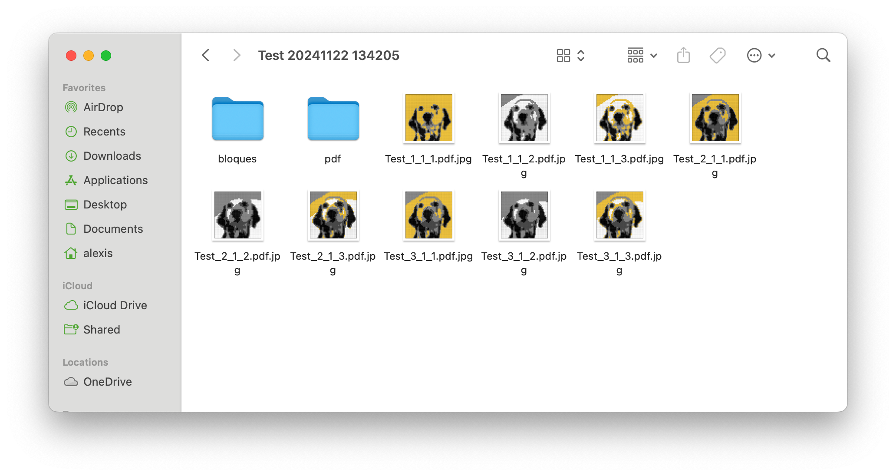

# LEGO Mosaic Maker in Python

This project is an alternative to the official LEGO Mosaic Maker service ([LEGO Mosaic Maker](https://www.lego.com/es-us/product/mosaic-maker-40179)), which allows converting images into LEGO-style mosaics. The program is written in Python and offers great flexibility, not only in the number of colors used in the mosaic but also in its dimensions.

## Description

The Python code takes a square JPG image as input and creates a LEGO mosaic based on it. The result includes:
- A LEGO-style mosaic image.
- A color map that displays the necessary LEGO bricks to build the mosaic.

## Requirements

To run the project, you need the following Python libraries:
- OpenCV
- NumPy
- Matplotlib

You can install these libraries using pip:

```bash
pip install opencv-python-headless numpy matplotlib
```

## Installation and Usage

1. Clone this repository or download the source code.
2. Place the square image (the image must always be square) in JPG format that you want to convert into a mosaic.
3. Configure the desired dimensions and number of colors.
4. Run the `mosaic.py` script from your terminal or development environment.

```bash
python mosaic.py
```

### Customizable Parameters

The code allows customization of several key parameters:

- **Input Image**: Path to the square JPG image you want to convert into a mosaic.
- **Number of Colors**: You can specify the number of colors for the mosaic. By default, the program uses 4 or 5 colors, but you can adjust this number.
- **Mosaic Dimensions**: By default, the size is 48x48 LEGO blocks, but you can adjust the dimensions to any size you need.

## Example Usage

If you have an image named `example.jpg` that you want to convert into a 5-color mosaic with dimensions of 32x32 blocks:

1. Adjust the parameters in the code or the main function.
2. Run the program.
3. The results will be saved in a folder organized by date and time, including:
   - The resized image.
   - The generated mosaic.
   - Versions of the mosaic using LEGO blocks.

## Generated Results

The program creates the following files in a folder named with the current date and time:

- A JPG image of the generated mosaic.
- Images of the individual LEGO blocks that make up the mosaic.
- Additional files with different versions of the mosaic.

## Examples

When running the code with the parameter of 5 colors, 9 different images are generated based on color density, allowing you to choose the one that best fits your needs.
<figure>
	
	<figcaption>Default result with 5 colors.</figcaption>
</figure>

### Result with 5 Colors and Dimensions of 48x48 Blocks
<figure>
	
	<figcaption>Test1 with 5 colors and dimensions of 48x48.</figcaption>
</figure>

### Result with 50 Colors and Dimensions of 96x96 Blocks
<figure>
	
	<figcaption>Test1 with 50 colors and dimensions of 96x96.</figcaption>
</figure>

## License

This project is licensed under the [MIT License](LICENSE).
